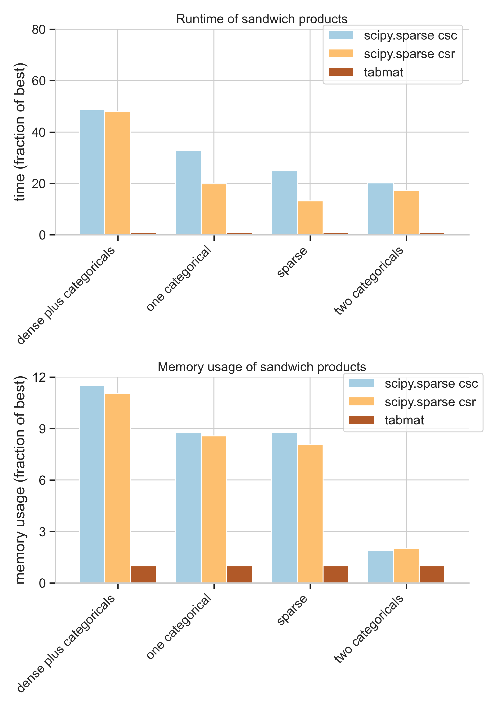
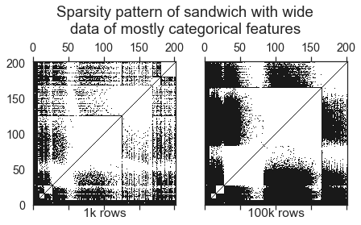

# Efficient matrix representations for working with tabular data


## Installation

Simply install via conda-forge!
```
conda install -c conda-forge tabmat
```



## Use case

TL;DR: We provide matrix classes for efficiently building statistical algorithms with data that is partially dense, partially sparse and partially categorical. 

Data used in economics, actuarial science, and many other fields is often tabular, containing rows and columns. Further common properties are also common:
- It often is **very sparse**.
- It often contains **a mix of dense and sparse** columns.
- It often contains **categorical data**, processed into many columns of indicator values created by "one-hot encoding."

High-performance statistical applications often require fast computation of certain operations, such as
- Computing **sandwich products** of the data, ``transpose(X) @ diag(d) @ X``. A sandwich product shows up in the solution to weighted least squares, as well as in the Hessian of the likelihood in generalized linear models such as Poisson regression.
- **Matrix-vector products**, possibly on only a subset of the rows or columns. For example, when limiting computation to an "active set" in a L1-penalized coordinate descent implementation, we may only need to compute a matrix-vector product on a small subset of the columns.
- Computing all operations on **standardized predictors** which have mean zero and standard deviation one. This helps with numerical stability and optimizer efficiency in a wide range of machine learning algorithms.

## This library and its design

We designed this library with the above use cases in mind. We built this library first for estimating generalized linear models, but expect it will be useful in a variety of econometric and statistical use cases. This library was borne out of our need for speed, and its unified API is motivated by the desire to work with a unified matrix API internal to our statistical algorithms.

Design principles:
- Speed and memory efficiency are paramount.
- You don't need to sacrifice functionality by using this library: `DenseMatrix` and `SparseMatrix` subclass `np.ndarray` and `scipy.sparse.csc_matrix` respectively, and inherit behavior from those classes wherever it is not improved on.
- As much as possible, syntax follows NumPy syntax, and dimension-reducing operations (like `sum`) return NumPy arrays, following NumPy dimensions about the dimensions of results. The aim is to make these classes as close as possible to being drop-in replacements for ``numpy.ndarray``.  This is not always possible, however, due to the differing APIs of ``numpy.ndarray`` and ``scipy.sparse``.
- Other operations, such as `toarray`, mimic Scipy sparse syntax.
- All matrix classes support matrix-vector products, sandwich products, and `getcol`.

Individual subclasses may support significantly more operations.

## Matrix types
- `DenseMatrix` represents dense matrices, subclassing numpy nparray.  It additionally supports methods `getcol`, `toarray`, `sandwich`, `standardize`, and `unstandardize`.
- `SparseMatrix` represents column-major sparse data, subclassing `scipy.sparse.csc_matrix`. It additionally supports methods `sandwich` and `standardize`.
- `CategoricalMatrix` represents one-hot encoded categorical matrices. Because all the non-zeros in these matrices are ones and because each row has only one non-zero, the data can be represented and multiplied much more efficiently than a generic sparse matrix.
- `SplitMatrix` represents matrices with both dense, sparse and categorical parts, allowing for a significant speedup in matrix multiplications.
- `StandardizedMatrix` efficiently and sparsely represents a matrix that has had its column normalized to have mean zero and variance one. Even if the underlying matrix is sparse, such a normalized matrix will be dense. However, by storing the scaling and shifting factors separately, `StandardizedMatrix` retains the original matrix sparsity. 



## Benchmarks

[See here for detailed benchmarking.](https://tabmat.readthedocs.io/en/latest/benchmarks.html)

## API documentation

[See here for detailed API documentation.](https://tabmat.readthedocs.io/en/latest/api.html)
