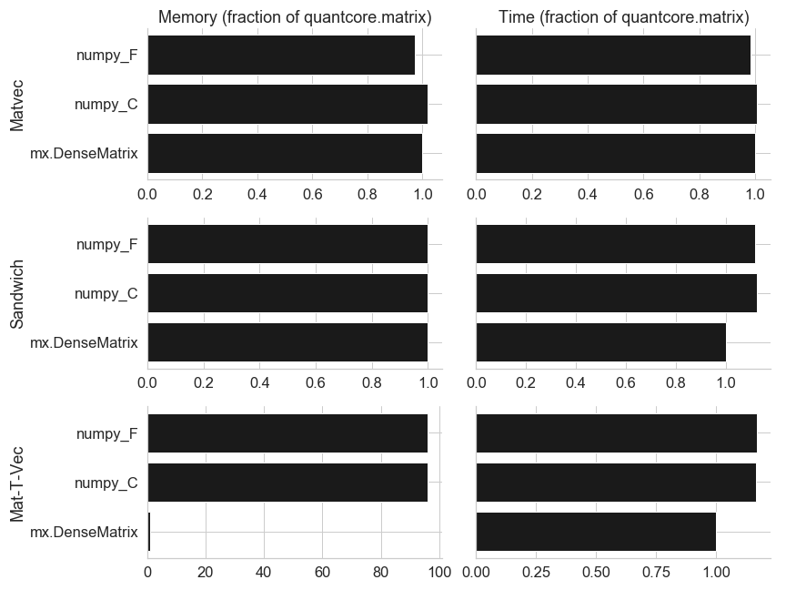
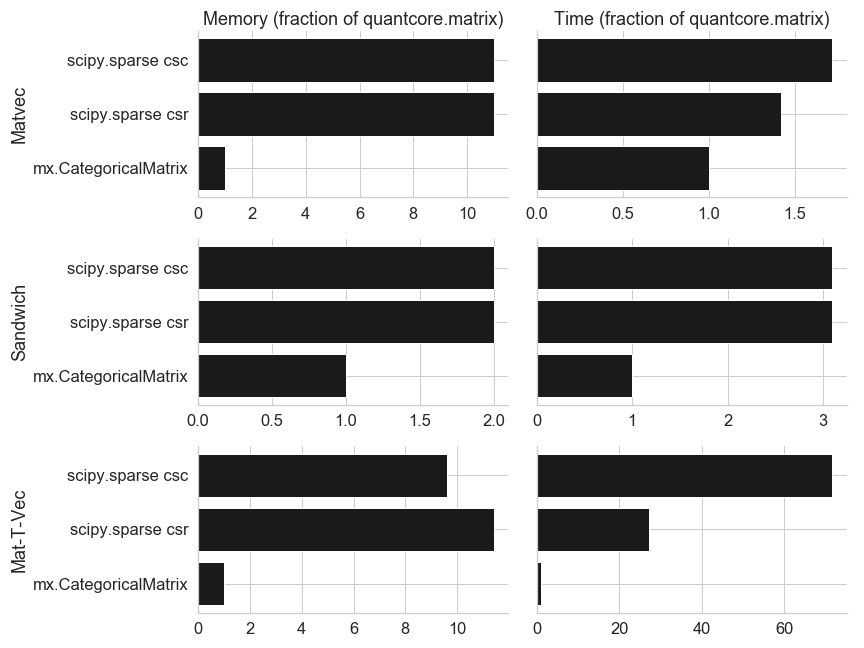
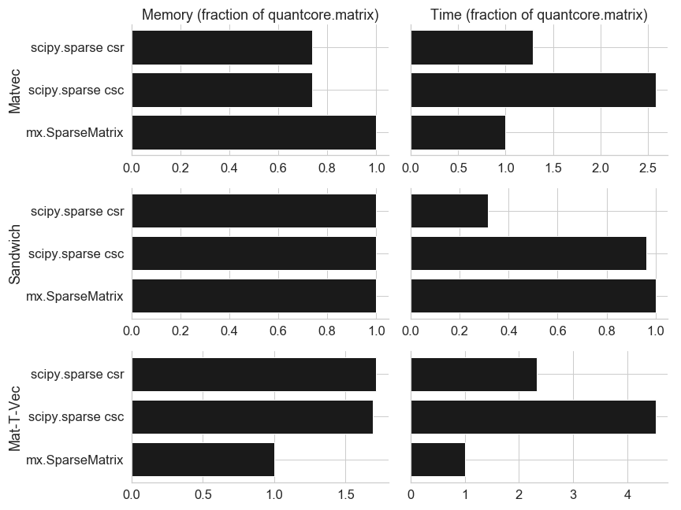
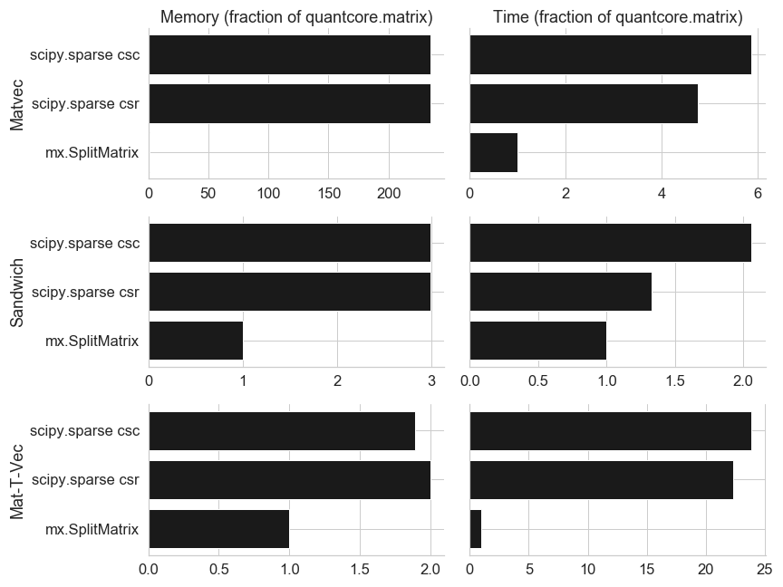
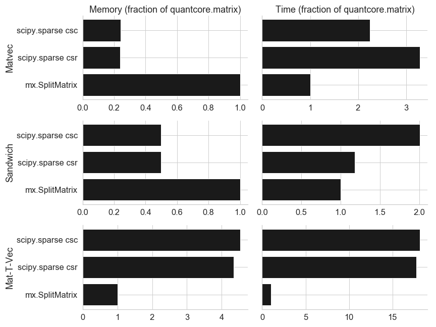

Benchmarks
==========
    
To generate the data to run all benchmarks, run: ``python src/quantcore/matrix/benchmark/generate_matrices.py``.

For more info on the benchmark CLI: ``python src/quantcore/matrix/benchmark/main.py --help``.

Performance
^^^^^^^^^^^

Dense matrix, 100k x 1k:

One-hot encoded categorical variable, 1M x 100k:

Sparse matrix, 1M x 1k:

Two categorical matrices, 1M x 2k:

