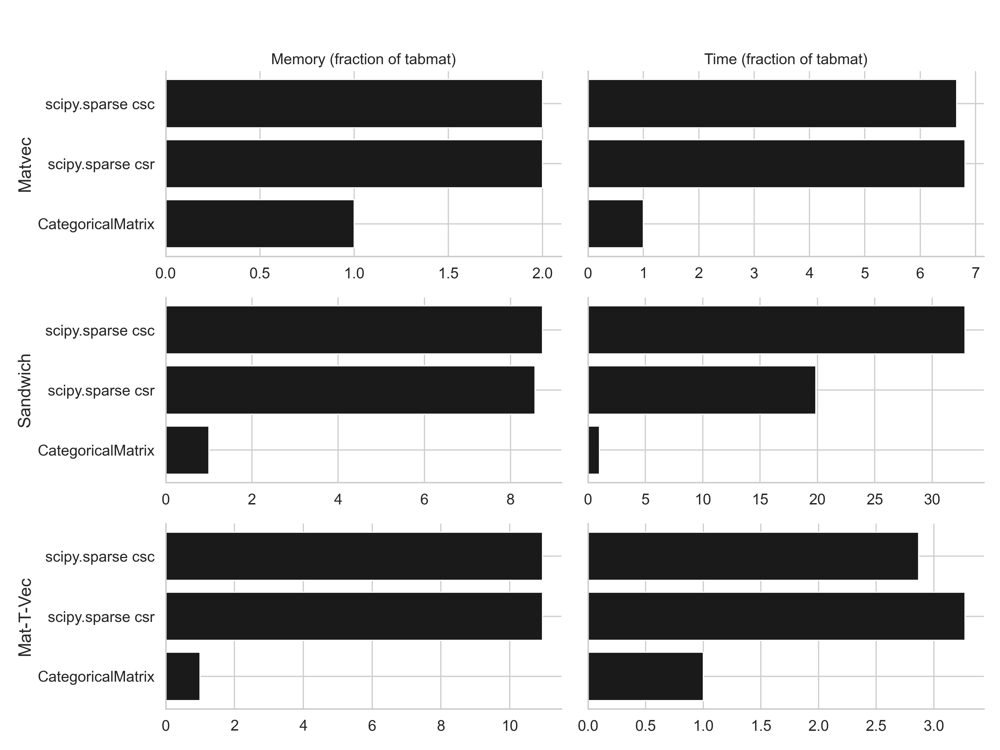
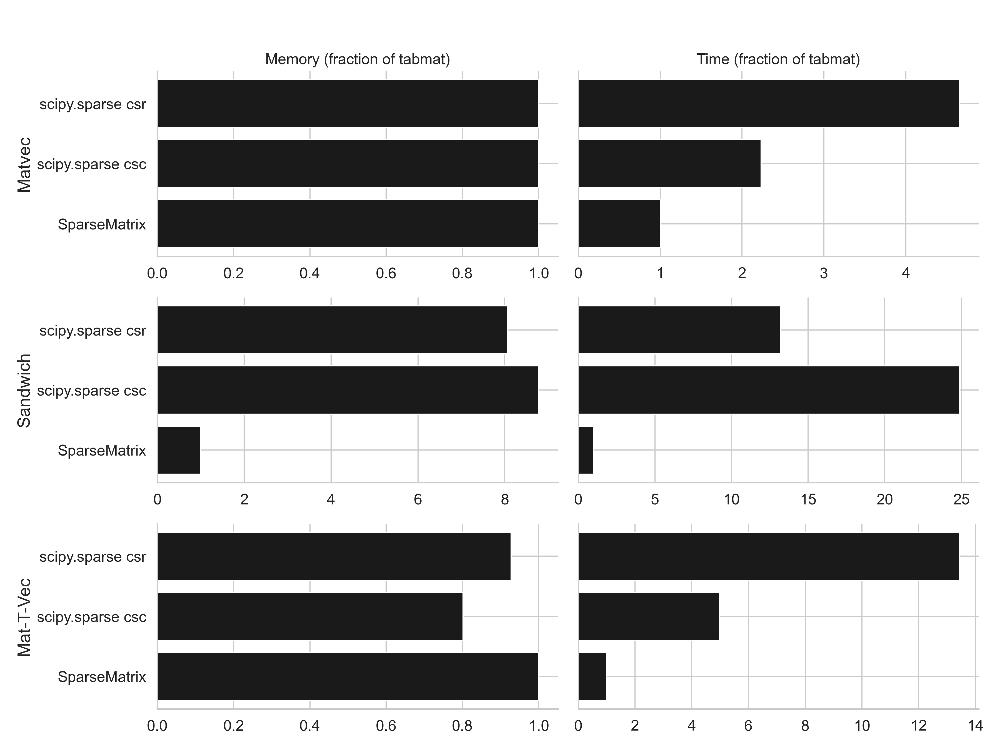
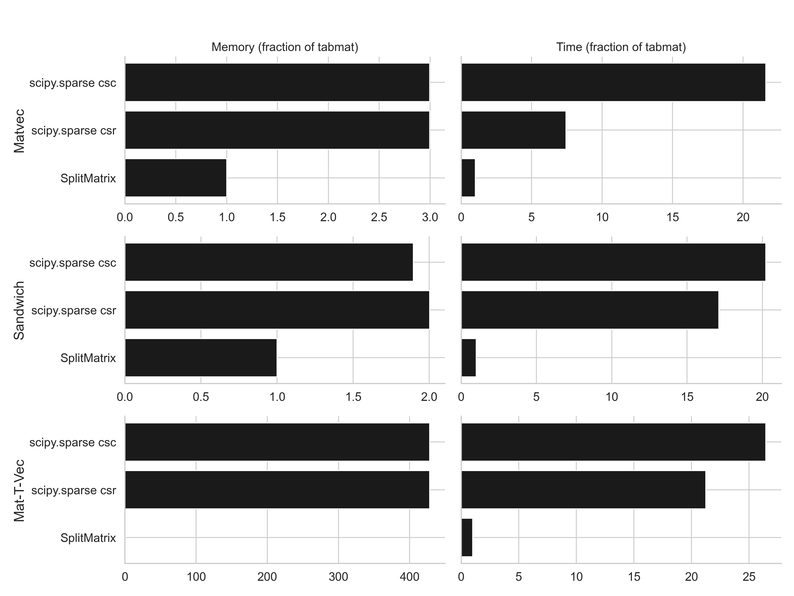

Benchmarks
==========
    
To generate the data to run all the benchmarks: ``python src/tabmat/benchmark/generate_matrices.py``. Then, to run all the benchmarks: ``python src/tabmat/benchmark/main.py``. To produce or update these figures, open ``src/tabmat/benchmark/visualize_benchmarks.py`` as a notebook via ``jupytext``. 

For more info on the benchmark CLI: ``python src/tabmat/benchmark/main.py --help``.

Performance
^^^^^^^^^^^

Dense matrix, 4M x 10:

One-hot encoded categorical variable, 1M x 100k:

Sparse matrix, 1M x 1k:

Two categorical matrices, 1M x 2k:

Dense matrix plus two categorical matrices, 3M x (dense=5, cat1=10, cat2=1000).

